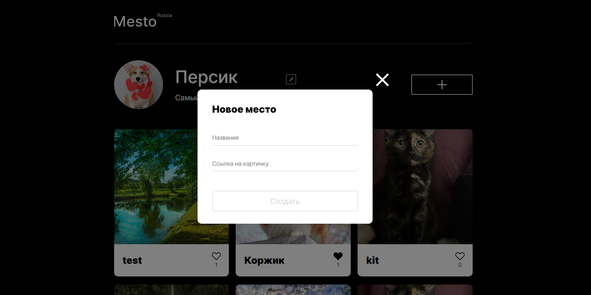
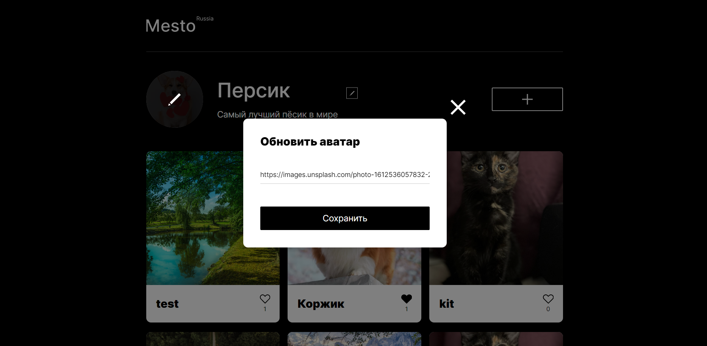

# Проект: Место - бэкенд

## Обзор

* Сайт проекта
* Описание проекта
* Что использовалось?
* Как запустить?

## **Сайт проекта**

[Ссылка на сайт](https://frantsuzovatamara.github.io/react-mesto-auth/)

## **Описание проекта**

Это бэкенд для проекта Место - интерактивной страницы, на которой можно:

* делиться своими фотографиями и видеть фотографии других пользователей

* удалять свои карточки (у личных карточек есть иконка урны, у карточек других пользователей такой иконки нет), ставить лайки своим карточкам и карточкам других пользователей

* редактировать свой профиль

* менять аватар профиля

* регистрироваться, авторизовываться (при повторном входе авторизация не нужна) и выходить из профиля

## **Что использовалось?**

* Node.js
* Express
* MongoDB
* Postman

## **Как запустить?**

Для запуска проекта необходимо запустить MongoDB, ввести в терминале команду **npm run start** в ветке main, после чего запустить [фронтенд приложения](https://github.com/FrantsuzovaTamara/react-mesto-auth.git) на 3001 порту.
